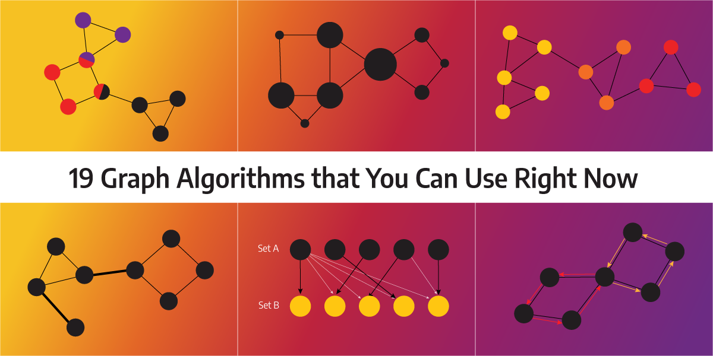
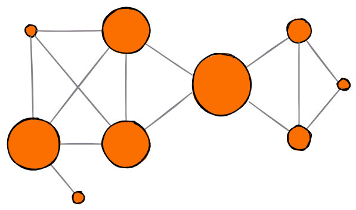

<!--truncate-->

Betweenness Centrality
----------------------

[Centrality analysis][betweenness centrality implementation link] provides information about the node's importance for 
an information flow or connectivity of the network. [Betweenness centrality][betweenness centrality wikipedia] is one 
of the most used centrality metrics that measures the extent to which a node lies on paths between other nodes in the 
graph. Thus, nodes with high betweenness may have considerable influence within a network under their control over 
information passing between others. The calculation of betweenness centrality is not standardized, and there are many 
ways to solve it.

It is defined as the number of shortest paths in the graph that passes through the node divided by the total number of 
shortest paths. The implemented algorithm is described in the paper "A Faster Algorithm for
[Betweenness Centrality](./betweenness-centrality-paper.pdf)" by Ulrik Brandes of the
[University of Konstanz][University of Konstanz].

A larger circle means larger betweenness centrality. The middle one has the largest amount of shortest paths flowing 
through it.

https://qubitpi.github.io/networkx/auto_examples/algorithms/plot_betweenness_centrality.html

https://qubitpi.github.io/networkx/reference/algorithms/generated/networkx.algorithms.centrality.betweenness_centrality.html#betweenness-centrality

[betweenness centrality implementation link]: https://qubitpi.github.io/memgraph-docs/mage/algorithms/traditional-graph-analytics/betweenness-centrality-algorithm/#implementation
[betweenness centrality wikipedia]: https://en.wikipedia.org/wiki/Betweenness_centrality

[University of Konstanz]: https://www.uni-konstanz.de/en/